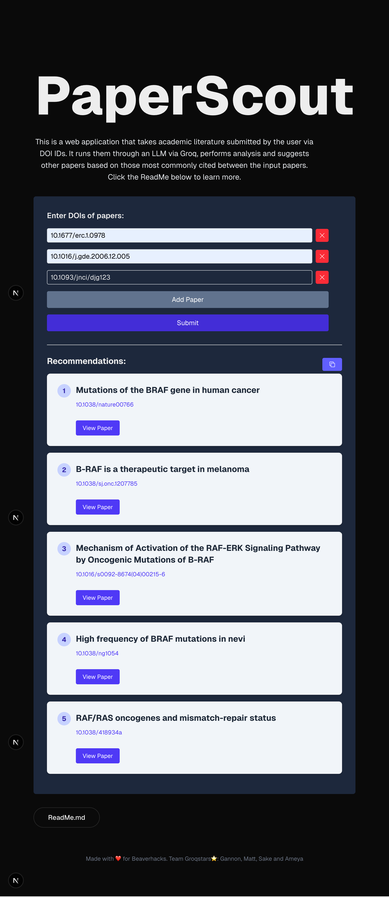

# PaperScout

Paper recommendations app using react, fastapi and groq to interface with llms.

## Overview

Our app allows the user to input a range of DOI numbers from 2 to 5 to get back papers our app recommends for further reading. This will be returned with cards in the app with clickable links. This program will go through each paper inputted and ask Meta’s LLaMA 4 Scout 17B (Instruct) model to get DOI numbers that are referenced in multiple papers. From that list, we rank them based on how many times they were cited. If there aren’t 5 papers from that list, we refer to Meta’s LLaMA 4 Scout 17B (Instruct) model to recommend additional papers. This helps address the problem of finding more papers to read and gather more information on a topic easily. 

## Features

- Input 2-5 DOI Numbers
- Get recommended papers returned to you based on their DOI numbers overlapping. The order presented is prioritized by how many times each paper is cited. 
If there aren't 5 papers with common DOI numbers, we use Groq to interface with Meta's LLaMA 4 Scout 17B (Instruct) to get additional papers. 
- Returned papers include links to the paper so that you can easily navigate to the recommended papers. 

## Tech Stack

- Python
- TypeScript
- CSS
- JavaScript
- FastApi
- OpenCitations Api
- Groq's Api

## Installation

This is a [Next.js](https://nextjs.org) project bootstrapped with [`create-next-app`](https://nextjs.org/docs/app/api-reference/cli/create-next-app).

## Getting Started

First, run the development server:

```bash
npm run dev
# or
yarn dev
# or
pnpm dev
# or
bun dev
```

Open [http://localhost:3000](http://localhost:3000) with your browser to see the result.

You can start editing the page by modifying `app/page.tsx`. The page auto-updates as you edit the file.

This project uses [`next/font`](https://nextjs.org/docs/app/building-your-application/optimizing/fonts) to automatically optimize and load [Geist](https://vercel.com/font), a new font family for Vercel.

## Learn More

To learn more about Next.js, take a look at the following resources:

- [Next.js Documentation](https://nextjs.org/docs) - learn about Next.js features and API.
- [Learn Next.js](https://nextjs.org/learn) - an interactive Next.js tutorial.

You can check out [the Next.js GitHub repository](https://github.com/vercel/next.js) - your feedback and contributions are welcome!

## Deploy on Vercel

The easiest way to deploy your Next.js app is to use the [Vercel Platform](https://vercel.com/new?utm_medium=default-template&filter=next.js&utm_source=create-next-app&utm_campaign=create-next-app-readme) from the creators of Next.js.

Check out our [Next.js deployment documentation](https://nextjs.org/docs/app/building-your-application/deploying) for more details.

## Examples

Here is a sample output!


## Team

- https://github.com/matt-o-west
- https://github.com/Ameya-P
- https://github.com/GannonCS
- https://github.com/5ak3
